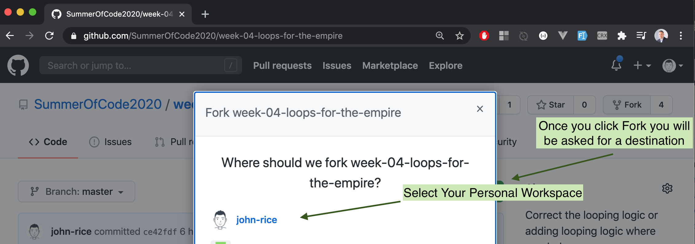
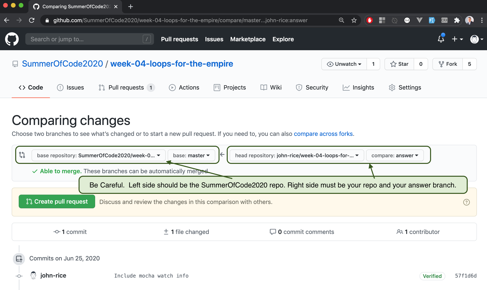

# SummerOfCode2020 Github Organization

Beginning in week 04, the source of our work will be from repositories in the SummerOfCode2020 organization.

<https://github.com/SummerOfCode2020>

## An Organization

That's us. We are a team that works on code together. With the SummerOfCode2020 organization we are connected in github.
We can now easily collaborate on code and make pull requests with any and all teaching assistants as well as any other students.

## A Fork in Github

A "fork" is a copy of a repository. Forking a repository allows you to freely experiment with changes on your personal copy independently from the original project.

A great advantage of forking the SummerOfCode2020 repositories is that we are given a page with links to navigate easily to all of the forks by all students.
(Marcus was here)
## The Process

We will be doing this every week.

- Browse to a repository within the organization as directed based on assignment
- Click the Fork button to Fork the organization's repository
- In the modal, select your Personal Workspace as the destination of the repository copy

## Notes

Don't "clone" the SummerOfCode2020 repositories. Only "fork" them.

Only "clone" your repositories from your workspace in github. Triple check the urls before you press the enter key in your `git clone` commands.

## Fixing incorrect git remotes

If you happen to make a mistake and clone a project from SummerOfCode2020, at any time you can remove your git "remotes" and replace them with your personal workspace project.

`git remote rm origin` will remove your incorrect origin.

`git remote add origin YOUR_URL_HERE` where YOUR_URL_HERE is replaced with a repository in your personal workspace.

## In Pictures

First: Fork

Next: Choose your personal github workspace as the destination

Final step on github is getting the url of your personal repository.

## Forking Guide on Github

<https://help.github.com/en/github/getting-started-with-github/fork-a-repo>

## Going back to SummerOfCode2020

Once you commit changes to your copy of a repo, you can make a pull request back to the SummerOfCode2020 repository.

